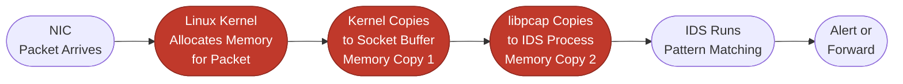
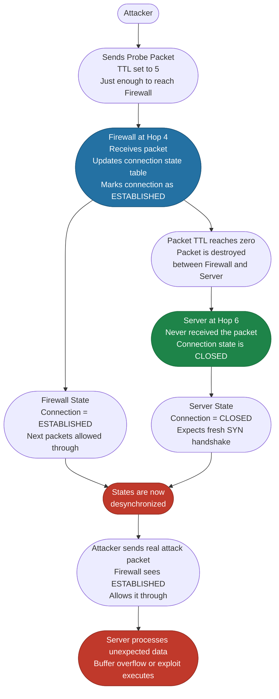
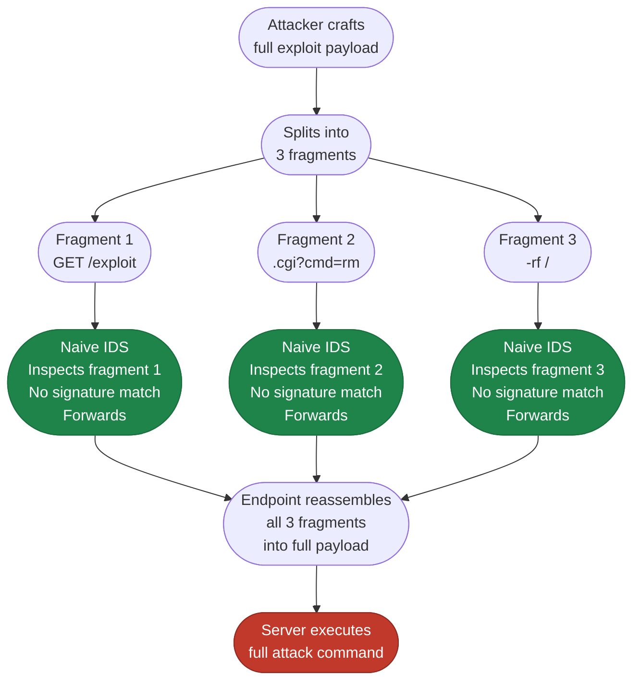
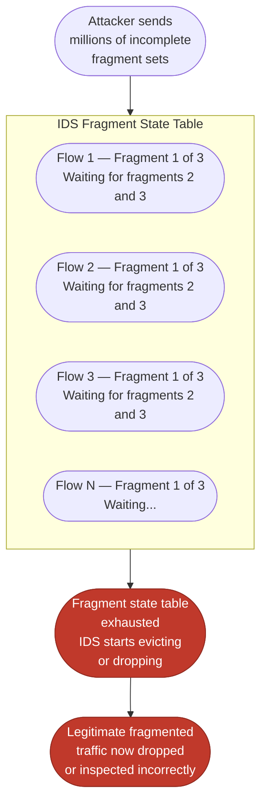
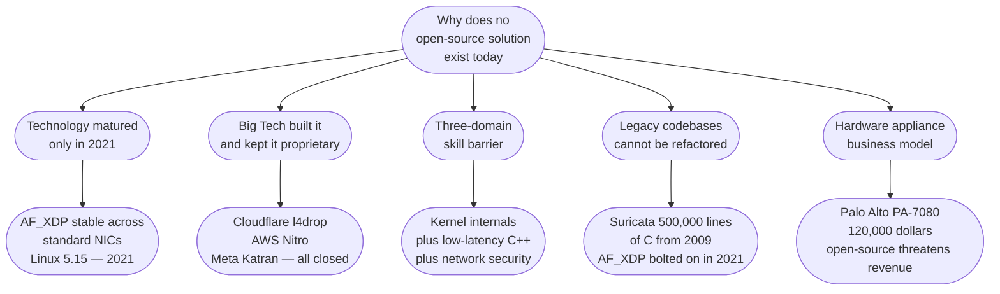
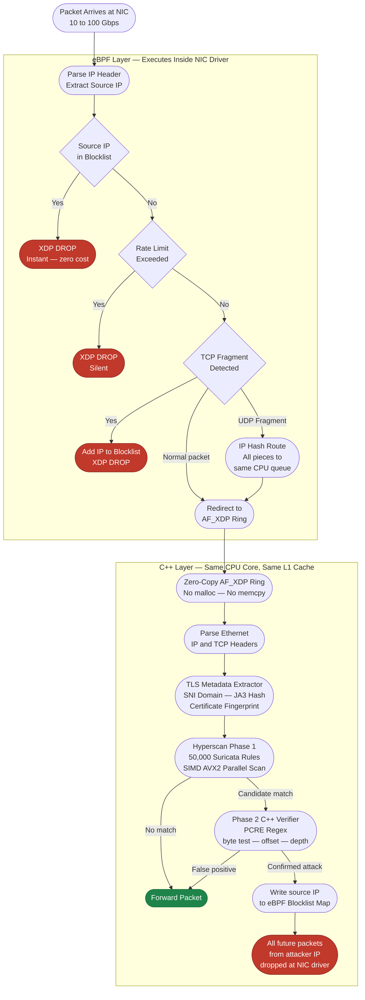

# AETHON
## Kernel-Bypass Network Intrusion Detection System
### Industry Evaluation — 19 September 2026

---

## SLIDE 1 — Title

# AETHON
### High-Speed Kernel-Bypass Intrusion Detection System

Detecting and Blocking Threats at Wire Speed Before the Operating System Wakes Up

**Core Technology Stack**

| Layer | Technology |
| :--- | :--- |
| Kernel Filter | eBPF / XDP |
| Packet Capture | AF_XDP Zero-Copy Ring Buffers |
| Pattern Matching | Intel Hyperscan (SIMD AVX2) |
| Engine Language | C++20 Lockless Architecture |

---

## SLIDE 2 — Problem Statement

### Networks Grew. Security Tools Did Not.

| Year | Standard Network Speed | IDS Built For |
| :--- | :--- | :--- |
| 2005 — Snort launched | 100 Mbps | 100 Mbps |
| 2009 — Suricata launched | 1 Gbps | 1 Gbps |
| 2026 — Today | 10 to 100 Gbps | Still 1 to 4 Gbps |

At 10 Gbps, the network delivers 14.8 million packets per second.
Traditional IDS software silently drops 40 to 90 percent of those packets.
**The system is blind during the very attack it was designed to detect.**

---

### Problem 1: The Traditional Packet Journey

Three memory copies and two kernel boundary crossings on every single packet.
At 14.8 million packets per second, the kernel performs 44 million memory copies per second.
The packet queue grows faster than the IDS can drain it.
**The IDS starts dropping packets silently — with no warning and no alert.**

---

### Problem 2: The Firewall State Desynchronization Attack

Firewalls maintain a state table — a record of every active TCP connection they have seen.
An attacker can deliberately desynchronize the firewall's state from the server's actual state.

> **The firewall and the server are never in the same network state. A packet with a carefully chosen TTL reaches the firewall but expires before the server. The firewall records the connection as established. The server never saw it. The attacker exploits this gap.**
>
> Traditional IDS tools deployed at the firewall position face this exact problem. Aethon deployed directly on the server NIC eliminates the gap entirely — it sees exactly what the server sees.

---

### Problem 3: IP Fragmentation — Two Distinct Attacks

**Attack A — Fragmentation Evasion (Ptacek and Newsham, 1998)**

Ptacek and Newsham demonstrated that a naive IDS can be bypassed when it analyzes IP fragments independently while the endpoint later reassembles those fragments into a complete packet.

Modern IDSes including Suricata and Snort address this by implementing IP defragmentation — reassembling fragments before running signature matching. The evasion attack above does not work against an IDS that reassembles before inspecting.

---

**Attack B — Fragment State Exhaustion (The Harder Problem)**

Implementing reassembly creates a new attack surface. The IDS must maintain a state table of incomplete fragment sets — each waiting for its remaining pieces to arrive.

Reassembly itself creates the state that an attacker can exhaust. A production-grade IDS requires maximum fragment tracker limits, per-flow timeouts, memory caps, eviction policies, and rate limiting on fragment arrival — not just reassembly logic.

---

**Why This Matters for Aethon**

In an AF_XDP architecture, packets arrive through the XDP path directly into userspace UMEM buffers — bypassing the kernel IP stack entirely. The resource pressure from a fragment flood occurs in the userspace packet buffers and the IDS's own reassembly state, not in kernel sk_buff allocations.

The engineering research question for Aethon is:

> How much fragment and flow state can the AF_XDP pipeline sustain before memory pressure causes packet loss or detection degradation — and what eviction policy minimises that degradation?

This is a measurable, concrete systems problem that distinguishes serious IDS engineering from naive implementations.

---

## SLIDE 3 — Why Nobody Built This Before

---

## SLIDE 4 — Aethon vs Suricata vs Snort

### The Critical Distinction: WHERE Fragment Handling Happens

```mermaid
flowchart TD
    subgraph Traditional ["Suricata and Snort — Fragment Handling in Userspace"]
        T1([NIC receives\nfragmented packets]) --> T2([Linux Kernel allocates\nmemory for EVERY fragment\nsk_buff per packet])
        T2 --> T3([Kernel copies all\nfragments to\nSocket Buffer])
        T3 --> T4([libpcap copies all\nfragments to\nSuricata memory])
        T4 --> T5([Suricata reassembles\nfragments in userspace\nPattern matching begins])

        T2:::cost
        T3:::cost
        T4:::cost
    end

    subgraph Aethon ["Aethon — Fragment Handling at NIC Driver Level"]
        A1([NIC receives\nfragmented packets]) --> A2([eBPF checks\nfragment type\nInside NIC driver])
        A2 -->|TCP Fragment\nAn attack by definition| A3([XDP DROP\nKernel allocates\nzero memory\nCPU never interrupted])
        A2 -->|UDP Fragment\nLegitimate traffic| A4([eBPF routes all\nfragments to same\nCPU core via IP hash])
        A4 --> A5([AF_XDP zero-copy\nto C++ worker])
        A5 --> A6([Pattern Matching\nwith Hyperscan])

        A3:::block
        A4:::route
    end

    classDef cost fill:#c0392b,color:#ffffff,stroke:#922b21
    classDef block fill:#1e8449,color:#ffffff,stroke:#196f3d
    classDef route fill:#2471a3,color:#ffffff,stroke:#1a5276
```

> Suricata reassembles fragments correctly — but only after each fragment has consumed kernel memory and been copied twice. During a fragment flood DDoS at 14 million packets per second, the kernel exhausts its memory budget for sk_buff allocations before Suricata sees a single packet. Aethon makes the decision in the NIC driver. The kernel allocator is never involved.

---

### Comparison Table

| Feature | Snort 3 | Suricata 7 | Aethon |
| :--- | :--- | :--- | :--- |
| Memory copies per packet | 3 | 1 to 2 | **0** |
| DDoS absorption layer | Userspace — too late | Userspace — too late | **eBPF at NIC driver** |
| Fragment detection | Userspace after kernel cost | Userspace after kernel cost | **NIC driver before allocation** |
| Fragment routing guarantee | OS misroutes pieces | OS misroutes pieces | **eBPF IP-hash deterministic** |
| Firewall TTL desync vulnerability | Exposed | Exposed | **Immune — same hop as server** |
| CPU core pinning | Manual configuration | Manual configuration | **Fully automatic** |
| Maximum throughput | 4 Gbps | 8 Gbps | **10 to 40 Gbps target** |
| CPU cores needed at 10 Gbps | 16 to 32 | 8 to 16 | **3 to 6** |
| Operator setup time | Hours of configuration | Hours of configuration | **One command** |

---

## SLIDE 5 — The Full Aethon Data Path

---

## SLIDE 6 — Work Completed

### What Has Been Built and Verified

| Feature | Status | Key Detail |
| :--- | :--- | :--- |
| AF_XDP Zero-Copy Pipeline | Complete | 8 MB UMEM shared between NIC and C++. FallbackRing stack-allocated, cacheline-aligned. No heap allocation. |
| Automatic Hardware Topology | Complete | Reads NIC queue count and CPU core count at startup. Pins threads automatically. One command to run. |
| eBPF TCP Fragment Block | Complete and Verified | Any IP-fragmented TCP packet blocks the source IP and drops instantly in NIC driver. Confirmed with Scapy attack simulation. |
| eBPF IP-Hash Fragment Routing | Complete | All fragments of one UDP flow deterministically routed to same CPU core via source plus destination IP hash. |
| Token Bucket Rate Limiter | Complete | 600 packets per minute per source IP. Per-CPU hash map with zero kernel spinlocks. |
| Suricata Rule Parsing | Complete | 52,232 rule files parsed. 50,968 valid rules converted to Hyperscan format. 25 MB rule database ready to load. |

---

### Attack Simulation Results

A TCP fragmentation evasion attack was simulated using the Scapy library.
11 IP-fragmented TCP packets were crafted and injected targeting port 80.

| Fragment | What Happened |
| :--- | :--- |
| Fragment 1 | eBPF detected TCP fragment. Source IP added to blocklist. XDP DROP executed. Log: TCP FRAGMENT ATTACK BLOCKED |
| Fragments 2 to 11 | Blocklist check triggered immediately. Silent XDP DROP. Zero packets reached application. |

**Result: The kernel never allocated memory for a single attack packet after Fragment 1 was identified.**

---

## SLIDE 7 — Timeline and Roadmap

### Development Phases — In Order

```mermaid
flowchart TD
    subgraph DONE ["Completed"]
        D1([AF_XDP Zero-Copy Pipeline])
        D2([eBPF TCP Fragment Block\nVerified with attack simulation])
        D3([eBPF UDP Fragment\nIP-Hash Routing])
        D4([Token Bucket Rate Limiter])
        D5([Suricata Rule Parsing\n50968 rules ready])
    end

    subgraph P1 ["Phase 1 — Hyperscan Integration"]
        P1A([Wire Hyperscan into rx_worker\nPattern matching on raw payloads])
        P1B([Phase 2 C++ Verifier\nOffset depth negated patterns PCRE])
    end

    subgraph P2 ["Phase 2 — UDP Fragment Reassembly Layer"]
        P2A([Build per-flow fragment\nreassembly state table in C++])
        P2B([Timeout and eviction policy\nfor incomplete fragment sets])
        P2C([Measure state exhaustion limits\nunder fragment flood conditions])
    end

    subgraph P3 ["Phase 3 — TCP State Maintaining Layer"]
        P3A([Per-flow TCP sequence tracking\nFive tuple hash table])
        P3B([Stream reassembly buffer\nfor multi-packet payload inspection])
        P3C([Detect cross-packet\nsignature evasion attacks])
    end

    subgraph P4 ["Phase 4 — Performance Measurement"]
        P4A([Measure packets per second\nat varying traffic loads])
        P4B([Measure latency NIC to alert\nunder 50000 rule load])
        P4C([Compare drop rate\nAethon versus Suricata baseline])
    end

    subgraph P5 ["Phase 5 — GPU Offload Research"]
        P5A([Batch encrypted TLS packets\nin AF_XDP ring])
        P5B([Transfer to GPU memory\nvia CUDA])
        P5C([AES decrypt on GPU\nReturn plaintext to Hyperscan])
        P5D([Measure actual throughput\nand PCIe latency cost\nVerify if it is worth it])
    end

    DONE --> P1 --> P2 --> P3 --> P4 --> P5

    DONE:::done
    P1:::next
    P2:::future
    P3:::future
    P4:::future
    P5:::research

    classDef done fill:#1a5276,color:#ffffff,stroke:#154360
    classDef next fill:#1e8449,color:#ffffff,stroke:#196f3d
    classDef future fill:#626567,color:#ffffff,stroke:#4d5656
    classDef research fill:#4a235a,color:#ffffff,stroke:#3b1a47
```

---

### Why This Order

| Phase | Why It Comes First |
| :--- | :--- |
| Hyperscan Integration | Without payload matching, the engine has no detection capability yet |
| UDP Fragment Reassembly | eBPF already routes UDP fragments to the same queue. C++ now needs to reassemble and inspect the complete payload |
| TCP State Layer | Extends reassembly to TCP streams. Required to detect cross-packet evasion attacks |
| Performance Measurement | Only meaningful after detection is fully functional. Benchmarks without detection are just packet forwarding numbers |
| GPU Offload Research | Investigated last because its value depends on measured throughput gaps. PCIe transfer cost may make it impractical for inline blocking |

---

### Target Metrics (After All Phases Complete)

| Metric | Aethon Target | Suricata 7 |
| :--- | :--- | :--- |
| Sustained Throughput | 10 plus Gbps | 4 to 8 Gbps |
| Packet Drop Rate at 10 Gbps | Less than 0.1 percent | 15 to 30 percent |
| NIC to Alert Latency | Less than 5 microseconds | 200 to 500 microseconds |
| DDoS Absorption | eBPF drops at NIC driver | All traffic hits userspace |
| CPU Cores at 10 Gbps | 3 to 6 | 8 to 16 |
| Operator Setup | One command | Hours of configuration |

---

## SLIDE 8 — Q&A Answers

**Q: Suricata also has IP defragmentation — what is actually different?**

Suricata and Snort do implement IP defragmentation. The original Ptacek and Newsham evasion attack does not work against them because they reassemble before matching. The real problem is the second attack: fragment state exhaustion. When an attacker sends millions of incomplete fragment sets, the IDS must maintain a state entry for each one waiting for the remaining pieces. The state table fills up and the IDS must evict entries or drop traffic. Implementing reassembly creates the state that the attacker can exhaust. Aethon's research question is how much fragment state the AF_XDP pipeline can sustain before degradation occurs, and what eviction policy minimises that degradation.

---

**Q: How does the TTL desynchronization attack work and how does Aethon prevent it?**

An attacker sends a probe packet with a TTL value precisely calculated to reach the firewall but expire before the server. The firewall records the connection as established in its state table. The packet never reaches the server — the server's state remains closed. The two endpoints are now desynchronized. The attacker then sends the real attack packet. The firewall, believing the connection is established, allows it through. Aethon deployed directly on the server NIC closes this gap. There is no network distance between Aethon and the application — it sees exactly what the server's network stack sees.

---

**Q: How does Aethon handle encrypted HTTPS traffic?**

Aethon cannot decrypt TLS payload without the session keys. What it can inspect is the TLS handshake metadata which is always transmitted in plaintext — the SNI domain name, TLS version, cipher suites, and the JA3 hash computed from those parameters. JA3 fingerprinting is a documented technique that identifies specific malware frameworks by their TLS handshake characteristics regardless of payload content. For full payload inspection, the application server can provide an SSLKEYLOGFILE. The GPU offload phase will investigate whether batched AES decryption on a CUDA device is fast enough to be practical inline — the PCIe transfer cost may make it suitable only for asynchronous forensic inspection rather than real-time blocking.

---

**Q: Why AF_XDP instead of DPDK?**

DPDK takes complete ownership of the NIC and removes it from Linux control. Standard tools including ip, iptables, tcpdump, and SSH routing stop working on that interface. AF_XDP achieves comparable zero-copy throughput while keeping the NIC under standard Linux management. Aethon runs on the same server as the web application using the same NIC with no trade-offs. Cloudflare migrated from DPDK to XDP in 2018 for this exact reason.

---

**Q: What happens to the blocklist during a botnet DDoS with millions of unique source IPs?**

The current implementation uses a fixed hash map with 65,536 entries. The production fix is BPF_MAP_TYPE_LRU_HASH which automatically evicts the least-recently-seen entry when full. Additionally BPF_MAP_TYPE_LPM_TRIE supports prefix matching — one entry covers an entire slash-24 subnet of 256 addresses, compressing millions of attacker IPs into a compact map.

